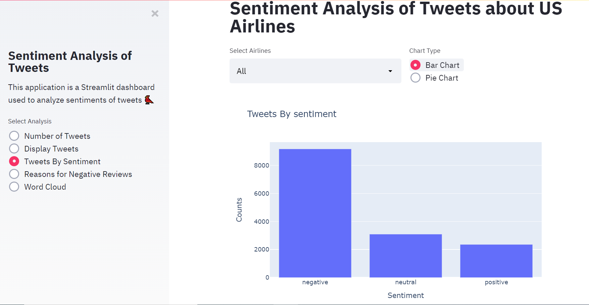
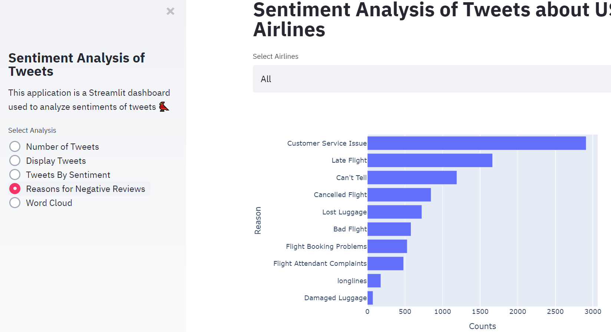
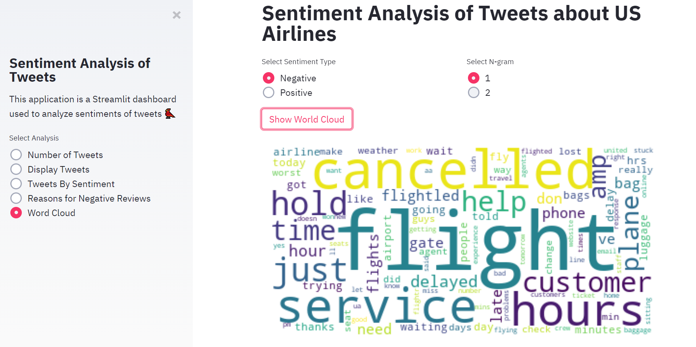

# US-Airline-Tweet-Analysis
Analyzing the tweets related to US airlines and creating a dashboard with streamlit to display the analysis results

Data used in the analysis is obtained from Kaggle at https://www.kaggle.com/crowdflower/twitter-airline-sentiment

Run the dasboard app using
```
streamlit run app.py
```


<p float="left">
  
   
  
</p>
